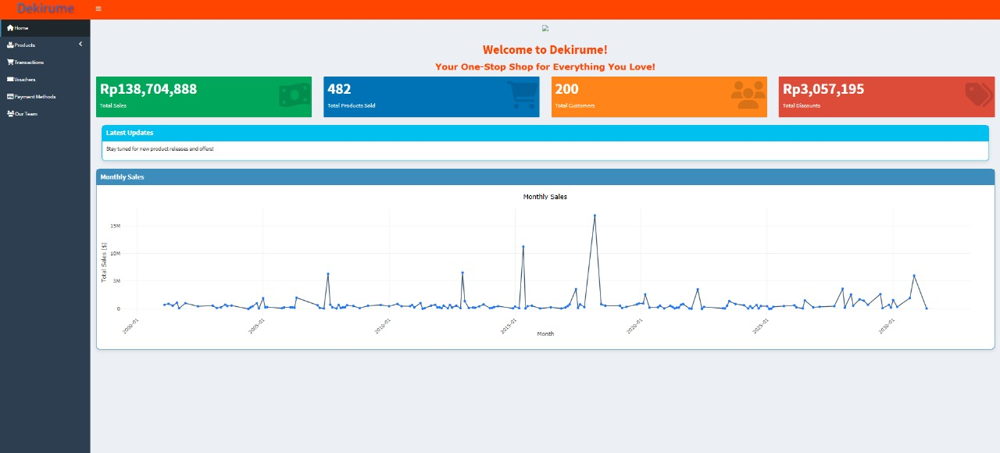
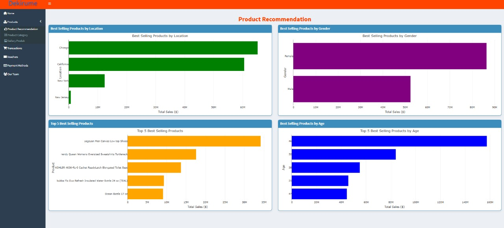
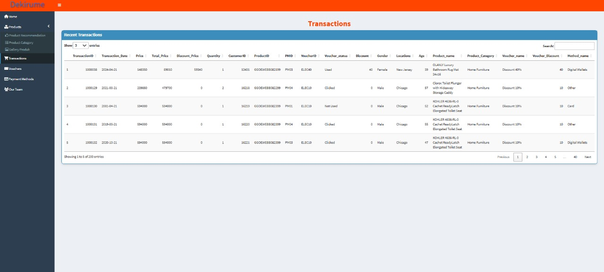
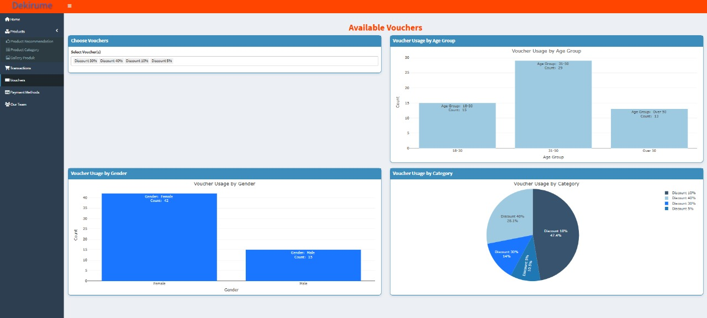
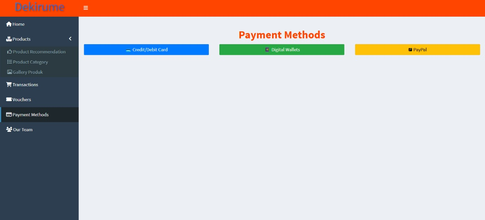

# Dekirume Online Shop

## *"Belanja Mudah, Pilihan Lengkap!"*

---

## 📌 Daftar Isi

- [Tentang Dekirume](#tentang-dekirume)
  - [Apa itu Dekirume?](#apa-itu-dekirume)
  - [Fitur Utama](#fitur-utama)
  - [Keunggulan Dekirume](#keunggulan-dekirume)
- [Cara Menggunakan](#cara-menggunakan)
- [Tentang Proyek](#tentang-proyek)
- [Tangkapan Layar](#tangkapan-layar)
- [Demo](#demo)
- [Persyaratan](#persyaratan)
- [Skema Database](#skema-database)
- [ERD](#erd)
- [Deskripsi Data](#deskripsi-data)
- [Struktur Folder](#struktur-folder)
- [Tim Kami](#tim-kami)

---

## 📢 Tentang Dekirume

### Apa itu Dekirume?

**Dekirume** adalah platform e-commerce inovatif yang menyediakan kemudahan dalam berbelanja secara online dengan fitur yang lengkap dan canggih. Menggunakan teknologi modern, Dekirume memungkinkan pengguna untuk melakukan transaksi dengan aman, cepat, dan efisien.

Dekirume juga dirancang untuk membantu analisis tren penjualan melalui sistem database yang kuat, memungkinkan bisnis untuk memahami perilaku pelanggan dan meningkatkan strategi pemasaran.

### ✨ Fitur Utama

✔️ **Pencarian Produk Cepat:** Temukan barang yang diinginkan dengan fitur pencarian yang responsif.  
✔️ **Kategori Produk Lengkap:** Produk dikelompokkan berdasarkan kategori untuk kemudahan navigasi.  
✔️ **Manajemen Voucher & Promo:** Nikmati berbagai promo eksklusif untuk pengguna terdaftar.  
✔️ **Metode Pembayaran Fleksibel:** Mendukung berbagai metode pembayaran seperti kartu kredit, e-wallet, dan transfer bank.  
✔️ **Dashboard Interaktif:** Pantau transaksi, histori belanja, dan tren penjualan dalam satu tampilan.

### ⭐ Keunggulan Dekirume

1. **Sistem Terintegrasi:** Semua data produk, transaksi, dan pelanggan tersimpan secara terpusat dan aman.
2. **User-Friendly Interface:** Tampilan antarmuka yang sederhana dan mudah digunakan oleh semua pengguna.
3. **Keamanan Data:** Informasi pelanggan dan transaksi dilindungi dengan sistem enkripsi terkini.
4. **Analisis Data Real-Time:** Menyediakan wawasan mendalam tentang tren penjualan dan preferensi pelanggan.

---

## 🚀 Cara Menggunakan Dekirume

1. **Jelajahi Produk:** Gunakan menu navigasi atau fitur pencarian untuk menemukan barang yang Anda inginkan.
2. **Detail Produk:** Lihat deskripsi, harga, stok, dan diskon sebelum melakukan pembelian.
3. **Tambahkan ke Keranjang:** Klik tombol **"Tambahkan ke Keranjang"** untuk menyimpan produk pilihan.
4. **Gunakan Voucher:** Pilih voucher yang tersedia untuk mendapatkan potongan harga eksklusif.
5. **Proses Pembayaran:** Pilih metode pembayaran yang sesuai, lalu selesaikan transaksi dengan aman.
6. **Pesanan Selesai!** Anda akan menerima konfirmasi dan dapat melacak pesanan melalui akun Dekirume. 🎉

---

## 📄 Tentang Proyek

Proyek ini dikembangkan sebagai bagian dari tugas akhir mata kuliah *Manajemen Data Statistik*. Tujuan utama dari sistem ini adalah untuk menganalisis pola penjualan, perilaku pelanggan, dan efektivitas voucher dalam transaksi e-commerce.

Dengan menggunakan **R**, **PostgreSQL**, dan **Shiny**, proyek ini menciptakan dashboard interaktif untuk memudahkan visualisasi dan analisis data secara real-time.

---

## 📸 Tangkapan Layar

### - Home  
<p align="center">
  
</p>

### - Product  
<p align="center">
  
</p>

### - Transactions  
<p align="center">
  
</p>

### - Voucher  
<p align="center">
  
</p>

### - Payment Methods  
<p align="center">
  
</p>
---

## 🎥 Demo

🔗 **Lihat demo proyek kami di:** [Dekirume Dashboard](https://yudheeet1991.shinyapps.io/mdskel4app/#)

---

## ⚠️ Persyaratan

- **Bahasa Pemrograman & Tools:** R (`rvest`, `tidyverse`, `rio`, `kableExtra`, `stringr`)
- **Database:** PostgreSQL & ElephantSQL
- **Framework Dashboard:** `shiny`, `shinythemes`, `bs4Dash`, `DT`, `dplyr`

---

## 🗂️ Skema Database

📌 **Diagram Relasi Antar Entitas**  


### 📌 Struktur Database

| **Entitas**        | **Atribut Utama** | **Relasi**                  |
| ------------------ | ----------------- | --------------------------- |
| **Customer**       | `customerid`      | Transaksi                   |
| **Product**        | `productid`       | Transaksi                   |
| **Voucher**        | `voucherid`       | Transaksi                   |
| **Payment Method** | `pmid`            | Transaksi                   |
| **Transaction**    | `transactionid`   | Menghubungkan semua entitas |

---

## 🔗 ERD

📊 **Entity-Relationship Diagram (ERD)**  


---

## 📊 Deskripsi Data

Struktur tabel yang digunakan dalam database Dekirume.

### :abacus: Create Database
The Sigmaria Market Online Shop database stores information that represents interconnected data attributes for the analysis.

```sql
CREATE DATABASE Online_Shop
    WITH
    OWNER = postgres
    ENCODING = 'UTF8'
    CONNECTION LIMIT = -1
    IS_TEMPLATE = False;
```
### :womans_clothes: Create Table Product
The product table provides information to users about products of the sigmaria market. Users can find out the product ID, product name, product description, product category, stock amount, and price of each product. Here is a description for each author's table.

| Attribute                  | Type                  | Description                     		       |
|:---------------------------|:----------------------|:------------------------------------------------|
| productid                  | character varying(20) | Id Produk                       		       |
| product_name               | text		     | Nama Produk                   		       |
| product_description        | text		     | Deskripsi Produk                      	       |	
| product_category           | text		     | Kategori Produk                 		       |
| stock	                     | integer		     | Jumlah Stok dari Setiap Produk	               |
| price		    	     | numeric               | Harga dari Masing-Masing Produk                 |

with the SQL script :

```sql
CREATE TABLE IF NOT EXISTS public.Product (
    ProductID character varying(20) NOT NULL,
    Product_name text NOT NULL,
    Product_Description text NOT NULL,
	Product_Category text NOT NULL,
	Stock integer NOT NULL,
	Price numeric NOT NULL,
    PRIMARY KEY (ProductID)
);
```
### :computer: Create Table Transaction
The transaction table presents information of transactions. Users can find out transaction ID, transaction date, total price of each transaction, quantity, customer ID, product ID, pay method ID, voucher ID, voucher status. The following is a description for each transaction table.

| Attribute                  | Type                  | Description                     		       |
|:---------------------------|:----------------------|:------------------------------------------------|
| transactionid              | character varying(20) | Id Transaksi                       	       |
| transaction_date           | date		     | Tanggal Transaksi                  	       |
| total_price                | numeric		     | Total Harga dari Tiap Transaksi                 |	
| quantity                   | integer		     | Jumlah Produk	                	       |
| customerid                 | character varying(11) | Id Customer                                     |
| productid    	    	     | character varying(20) | Id Produk	                               |
| pmid	                     | character varying(11) | Id Pay Method     			       |
| voucherid		     | character varying(11) | Id Voucher				       |
| voucher_status             | text		     | Status Voucher                   	       |

with the SQL script :

```sql
CREATE TABLE IF NOT EXISTS public.Transaction (
    TransactionID character varying(20) NOT NULL,
    Transaction_Date date NOT NULL,
    Total_price numeric NOT NULL,
	Quantity integer NOT NULL,
	CustomerID character varying(11) NOT NULL,
	ProductID character varying(20) NOT NULL,
	PMID character varying(11) NOT NULL,
	VoucherID character varying(11) NOT NULL,
	Voucher_status text NOT NULL,
	PRIMARY KEY (TransactionID),
	FOREIGN KEY (CustomerID) REFERENCES Customer (CustomerID),
	FOREIGN KEY (ProductID) REFERENCES Product (ProductID),
	FOREIGN KEY (PMID) REFERENCES Pay_method (PMID),
	FOREIGN KEY (VoucherID) REFERENCES Voucher (VoucherID)
);
```
### :ticket: Create Table Voucher
The voucher table presents information about a voucher. Besides being able to know the number of products, users will also get information about available vouchers. Users will get the voucher information about the name of the voucher and the amount of the discount on the voucher. Below is a description of the voucher table.

| Attribute                  | Type                  | Description                     		       |
|:---------------------------|:----------------------|:------------------------------------------------|
| voucherid                  | character varying(11) | Id Voucher                       	       |
| voucher_name               | text		     | Nama Voucher                  		       |
| discount                   | integer		     | Besaran Diskon dari Setiap Voucher              |	

with the SQL script :

```sql
CREATE TABLE IF NOT EXISTS public.Voucher (
    VoucherID character varying(11) NOT NULL,
    Voucher_name text NOT NULL,
	Discount integer NOT NULL,
	PRIMARY KEY (VoucherID)
);
```
### :credit_card: Create Table Pay_Method
The pay_method table provides information to the users about payment methods which consist of 4 methods, there are card, PayPal, digital wallets and others from PMID and the method name of each ID. Here's a description for each pay_method table.

| Attribute          | Type                  | Description                     |
|:-------------------|:----------------------|:--------------------------------|
| pmid               | character varying(11) | Id pay method                   |
| method_name        | text		     | nama metode pembayaran	       |

with the SQL script :

```sql
CREATE TABLE IF NOT EXISTS public.Pay_method (
    PMID character varying(11) NOT NULL,
    Method_name text NOT NULL,
	PRIMARY KEY (PMID)
);
```
### :couple: Create Table Customer
The customer table provides information to the user regarding customer data, so that the user can find out the customer ID, gender, location which includes 4 locations, there are California, New York, Chicago, New Jersey and age range 17 - 63 years. Here is a description for each customer table. 

| Attribute          | Type                  | Description                     |
|:-------------------|:----------------------|:--------------------------------|
| customerid         | character varying(11) | Id Customer                     |
| gender             | character varying(11) | Jenis Kelamin                   |
| locations          | text		     | Lokasi                          |
| age		     | integer	 	     | Umur	                       |

with the SQL script : 

```sql
CREATE TABLE IF NOT EXISTS public.Customer (
    CustomerID character varying(11) NOT NULL,
    Gender character varying(11) NOT NULL,
    Locations text NOT NULL,
	Age integer NOT NULL,
    PRIMARY KEY (CustomerID)
);
```

---

## 📂 Struktur Folder

📁 **Struktur direktori proyek**:

```
.
├── Image
├── app           # Aplikasi Shiny
│   ├── css
│   ├── server.R
│   └── ui.R
├── data          # Data proyek
│   ├── csv
│   └── sql
│       └── db.sql
├── doc           # Dokumentasi proyek
├── src           # Kode sumber proyek
├── .gitignore
└── README.md
```

---

## ❤️ Tim Kami
### Frontend & Backend Developer: [Dela Gustiara](https://github.com/delagustiara24)


### Database Manager: [Rupmana Br Butar Butar](https://github.com/Rupmana03)


### Copy Writer: [Rizqi Annafi Muhadi](https://github.com/rizqiannafii)


### Database Designer: [Mega Maulina](https://github.com/megaamln)


---

📢 **Terima kasih telah membaca dokumentasi ini!** Jika ada pertanyaan atau saran, jangan ragu untuk menghubungi tim kami. Selamat berbelanja dengan Dekirume! 🚀
