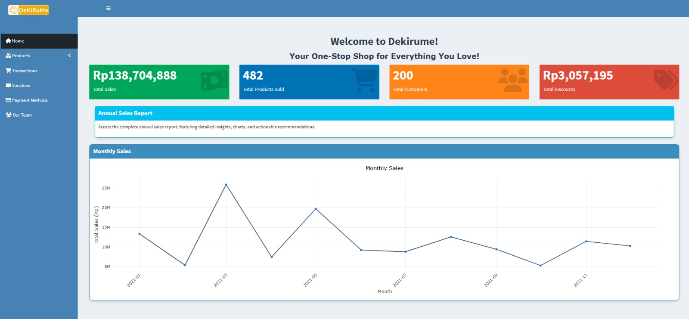
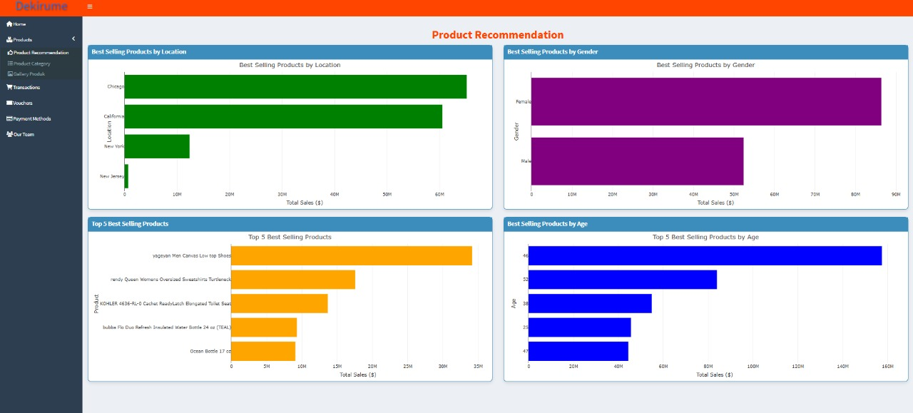
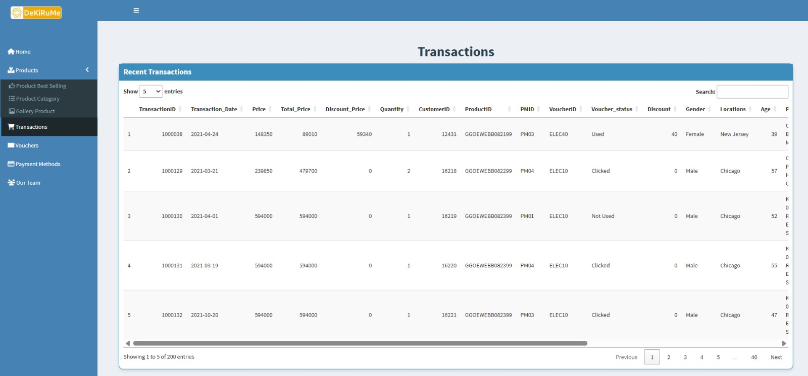
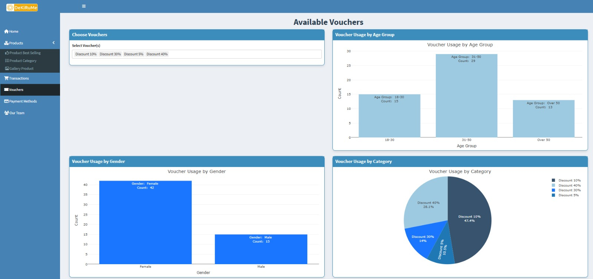
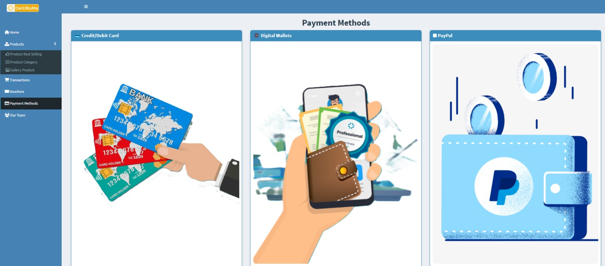

# Dekirume Online Shop

## *"Belanja Mudah, Pilihan Lengkap!"*

---

## 📌 Daftar Isi

- [Tentang Dekirume](#tentang-dekirume)
  - [Apa itu Dekirume?](#apa-itu-dekirume)
  - [Fitur Utama](#fitur-utama)
  - [Keunggulan Dekirume](#keunggulan-dekirume)
- [Cara Menggunakan](#cara-menggunakan)
- [Tentang Proyek](#tentang-proyek)
- [Tangkapan Layar](#tangkapan-layar)
- [Demo](#demo)
- [Skema Database](#skema-database)
- [ERD](#erd)
- [Deskripsi Data](#deskripsi-data)
- [Struktur Folder](#struktur-folder)
- [Tim Kami](#tim-kami)

---

## 📢 Tentang Dekirume

### Apa itu Dekirume?

**Dekirume** adalah platform e-commerce inovatif yang menyediakan kemudahan dalam berbelanja secara online dengan fitur yang lengkap dan canggih. Menggunakan teknologi modern, Dekirume memungkinkan pengguna untuk melakukan transaksi dengan aman, cepat, dan efisien.

Dekirume juga dirancang untuk membantu analisis tren penjualan melalui sistem database yang kuat, memungkinkan bisnis untuk memahami perilaku pelanggan dan meningkatkan strategi pemasaran.

### ✨ Fitur Utama

✔️ **Pencarian Produk Cepat:** Temukan barang yang diinginkan dengan fitur pencarian yang responsif.  
✔️ **Kategori Produk Lengkap:** Produk dikelompokkan berdasarkan kategori untuk kemudahan navigasi.  
✔️ **Manajemen Voucher & Promo:** Nikmati berbagai promo eksklusif untuk pengguna terdaftar.  
✔️ **Metode Pembayaran Fleksibel:** Mendukung berbagai metode pembayaran seperti kartu kredit, e-wallet, dan transfer bank.  
✔️ **Dashboard Interaktif:** Pantau transaksi, histori belanja, dan tren penjualan dalam satu tampilan.

### ⭐ Keunggulan Dekirume

1. **Sistem Terintegrasi:** Semua data produk, transaksi, dan pelanggan tersimpan secara terpusat dan aman.
2. **User-Friendly Interface:** Tampilan antarmuka yang sederhana dan mudah digunakan oleh semua pengguna.
3. **Keamanan Data:** Informasi pelanggan dan transaksi dilindungi dengan sistem enkripsi terkini.
4. **Analisis Data Real-Time:** Menyediakan wawasan mendalam tentang tren penjualan dan preferensi pelanggan.

---

## 🚀 Cara Menggunakan Dekirume

1. **Jelajahi Produk:** Gunakan menu navigasi atau fitur pencarian untuk menemukan barang yang Anda inginkan.
2. **Detail Produk:** Lihat deskripsi, harga, stok, dan diskon sebelum melakukan pembelian.
3. **Tambahkan ke Keranjang:** Klik tombol **"Tambahkan ke Keranjang"** untuk menyimpan produk pilihan.
4. **Gunakan Voucher:** Pilih voucher yang tersedia untuk mendapatkan potongan harga eksklusif.
5. **Proses Pembayaran:** Pilih metode pembayaran yang sesuai, lalu selesaikan transaksi dengan aman.
6. **Pesanan Selesai!** Anda akan menerima konfirmasi dan dapat melacak pesanan melalui akun Dekirume. 🎉

---

## 📄 Tentang Proyek

Proyek ini dikembangkan sebagai bagian dari tugas akhir mata kuliah *Manajemen Data Statistik*. Tujuan utama dari sistem ini adalah untuk menganalisis pola penjualan, perilaku pelanggan, dan efektivitas voucher dalam transaksi e-commerce.

Dengan menggunakan **R**, **PostgreSQL**, dan **Shiny**, proyek ini menciptakan dashboard interaktif untuk memudahkan visualisasi dan analisis data secara real-time.

---

## 📸 Tangkapan Layar

### - Home  
<p align="center">
  
</p>

### - Product  
<p align="center">
  
</p>

### - Transactions  
<p align="center">
  
</p>

### - Voucher  
<p align="center">
  
</p>

### - Payment Methods  
<p align="center">
  
</p>
---

## 🎥 Demo

🔗 **Lihat demo proyek kami di:** [Dekirume Dashboard](https://yudheeet1991.shinyapps.io/mdskel4app/#)

---

## 🗂️ Skema Database

📌 **Diagram Relasi Antar Entitas**  


### 📌 Struktur Database

| **Entitas**        | **Atribut Utama** | **Relasi**                  |
| ------------------ | ----------------- | --------------------------- |
| **Customer**       | `customerid`      | Transaksi                   |
| **Product**        | `productid`       | Transaksi                   |
| **Voucher**        | `voucherid`       | Transaksi                   |
| **Payment Method** | `pmid`            | Transaksi                   |
| **Transaction**    | `transactionid`   | Menghubungkan semua entitas |

---

## 🔗 ERD

📊 **Entity-Relationship Diagram (ERD)**  


---

## 📊 Deskripsi Data

Dalam sistem ini, kita menggunakan PostgreSQL sebagai database utama untuk menyimpan dan mengelola data e-commerce Dekirume. Struktur tabel yang digunakan dalam database Dekirume.

### 1️⃣ Membuat Database
The Sigmaria Market Online Shop database stores information that represents interconnected data attributes for the analysis.

```sql
CREATE DATABASE Online_Shop
    WITH
    OWNER = postgres
    ENCODING = 'UTF8'
    CONNECTION LIMIT = -1
    IS_TEMPLATE = False;
```
### Create Table Product
Tabel produk berfungsi sebagai sumber informasi utama bagi pengguna untuk mengetahui detail berbagai produk yang tersedia di pasar Dekirume. Melalui tabel ini, pengguna dapat mengakses data penting, termasuk ID produk sebagai identitas unik, nama produk, deskripsi yang menjelaskan karakteristiknya, kategori produk untuk klasifikasi yang lebih terstruktur, jumlah stok yang mencerminkan ketersediaan barang, serta harga yang menjadi acuan dalam transaksi.

| Attribute                  | Type                  | Description                     		       |
|:---------------------------|:----------------------|:------------------------------------------------|
| productid                  | varchar               | Id Produk                       		       |
| product_name               | varchar		     | Nama Produk                   		       |
| product_description        | text		     | Deskripsi Produk                      	       |	
| product_category           | varchar		     | Kategori Produk                 		       |
| stock	                     | integer		     | Jumlah Stok dari Setiap Produk	               |
| price		    	     | decimal(10,2)         | Harga dari Masing-Masing Produk                 |

with the SQL script :

```sql
CREATE TABLE IF NOT EXISTS data_product (
      ProductID VARCHAR(20) PRIMARY KEY,
      Product_name VARCHAR(100),
      Product_Description TEXT,
      Product_Category VARCHAR(50),
      Stock INT,
      Price DECIMAL(10,2)
    );
```
### Create Table Transaction
Tabel transaksi berfungsi sebagai wadah penyimpanan data yang mencatat seluruh aktivitas transaksi yang terjadi. Melalui tabel ini, pengguna dapat mengakses berbagai informasi penting terkait transaksi, termasuk ID transaksi sebagai identitas unik, tanggal transaksi untuk pencatatan waktu, serta total harga yang mencerminkan nilai keseluruhan dari setiap transaksi. Selain itu, tabel ini juga mencakup jumlah produk yang dibeli, ID pelanggan untuk mengidentifikasi pembeli, ID produk yang menunjukkan barang yang dibeli, ID metode pembayaran untuk mencatat cara pembayaran yang digunakan, serta ID voucher beserta status penggunaannya.

| Attribute                  | Type                  | Description                     		       |
|:---------------------------|:----------------------|:------------------------------------------------|
| transactionid              | integer               | Id Transaksi                       	       |
| transaction_date           | date		     | Tanggal Transaksi                  	       |
| total_price                | decimal		     | Total Harga dari Tiap Transaksi                 |	
| quantity                   | integer		     | Jumlah Produk	                	       |
| customerid                 | integer               | Id Customer                                     |
| productid    	    	     | varchar               | Id Produk	                               |
| pmid	                     | varchar               | Id Pay Method     			       |
| voucherid		     | varchar               | Id Voucher				       |
| voucher_status             | varchar		     | Status Voucher                   	       |

with the SQL script :

```sql
CREATE TABLE IF NOT EXISTS data_transaction (
      TransactionID INT PRIMARY KEY,
      Transaction_Date DATE,
      Price DECIMAL(10,2),
      Total_Price DECIMAL(10,2),
      Discount_Price DECIMAL(10,2),
      Quantity INT,
      CustomerID INT,
      ProductID VARCHAR(20),
      PMID VARCHAR(10),
      VoucherID VARCHAR(10) NULL,
      Voucher_status VARCHAR(20),
      Discount DECIMAL(5,2),
      FOREIGN KEY (CustomerID) REFERENCES data_customer(CustomerID) ON DELETE CASCADE ON UPDATE CASCADE,
      FOREIGN KEY (ProductID) REFERENCES data_product(ProductID) ON DELETE CASCADE ON UPDATE CASCADE,
      FOREIGN KEY (VoucherID) REFERENCES data_voucher(VoucherID) ON DELETE CASCADE ON UPDATE CASCADE,
      FOREIGN KEY (PMID) REFERENCES data_payment_method(PMID) ON DELETE CASCADE ON UPDATE CASCADE
    );
```
### Create Table Voucher
Tabel voucher menyajikan informasi mendetail mengenai voucher yang tersedia. Selain mengetahui jumlah produk yang memenuhi syarat untuk penggunaan voucher, pengguna juga dapat mengakses berbagai data penting terkait voucher yang dapat digunakan. Informasi yang disediakan mencakup nama voucher sebagai identitasnya serta nilai diskon yang diberikan melalui voucher tersebut.

| Attribute                  | Type                  | Description                     		       |
|:---------------------------|:----------------------|:------------------------------------------------|
| voucherid                  | varchar               | Id Voucher                       	       |
| voucher_name               | varchar		     | Nama Voucher                  		       |
| discount                   | decimal(5,2)	     | Besaran Diskon dari Setiap Voucher              |	

with the SQL script :

```sql
CREATE TABLE IF NOT EXISTS data_voucher (
      VoucherID VARCHAR(10) PRIMARY KEY,
      Voucher_name VARCHAR(100),
      Discount DECIMAL(5,2)
    );
```
### Create Table Payment Method
Tabel payment method menyajikan informasi mengenai metode pembayaran yang tersedia bagi pengguna. Tabel ini mencakup empat jenis metode pembayaran utama, yaitu kartu, PayPal, dompet digital, serta metode lainnya. Setiap metode pembayaran diidentifikasi dengan PMID (Payment Method ID) sebagai kode unik, serta nama metode pembayaran yang sesuai dengan setiap ID.

| Attribute          | Type                  | Description                     |
|:-------------------|:----------------------|:--------------------------------|
| pmid               | varchar               | Id pay method                   |
| method_name        | varchar		     | nama metode pembayaran	       |

with the SQL script :

```sql
CREATE TABLE IF NOT EXISTS data_payment_method (
      PMID VARCHAR(10) PRIMARY KEY,
      Method_name VARCHAR(50)
    );
```
### Create Table Customer
Tabel customer berisi informasi penting mengenai data pelanggan, memungkinkan pengguna untuk mengakses berbagai detail terkait identitas pelanggan. Informasi yang tercakup dalam tabel ini meliputi Customer ID sebagai identitas unik setiap pelanggan, jenis kelamin, serta lokasi pelanggan yang mencakup empat wilayah utama, yaitu California, New York, Chicago, dan New Jersey. Selain itu, tabel ini juga mencatat rentang usia pelanggan, yang berada dalam kisaran 17 hingga 63 tahun.

| Attribute          | Type                  | Description                     |
|:-------------------|:----------------------|:--------------------------------|
| customerid         | integer               | Id Customer                     |
| gender             | varchar               | Jenis Kelamin                   |
| locations          | varchar		     | Lokasi                          |
| age		     | integer	 	     | Umur	                       |

with the SQL script : 

```sql
CREATE TABLE IF NOT EXISTS data_customer (
      CustomerID INT PRIMARY KEY,
      Gender VARCHAR(10),
      Locations VARCHAR(50),
      Age INT
    );
```

---

## 📂 Struktur Folder

📁 **Struktur direktori proyek**:

```
.
├── Image
├── app           # Aplikasi Shiny
│   ├── css
│   ├── server.R
│   └── ui.R
├── data          # Data proyek
│   ├── csv
│   └── sql
│       └── db.sql
├── doc           # Dokumentasi proyek
├── src           # Kode sumber proyek
├── .gitignore
└── README.md
```

---

## ❤️ Tim Kami
### Frontend & Backend Developer: [Dela Gustiara](https://github.com/delagustiara24)


### Database Manager: [Rupmana Br Butar Butar](https://github.com/Rupmana03)


### Copy Writer: [Rizqi Annafi Muhadi](https://github.com/rizqiannafii)


### Database Designer: [Mega Maulina](https://github.com/megaamln)


---

📢 **Terima kasih telah membaca dokumentasi ini!** Jika ada pertanyaan atau saran, jangan ragu untuk menghubungi tim kami. Selamat berbelanja dengan Dekirume! 🚀
